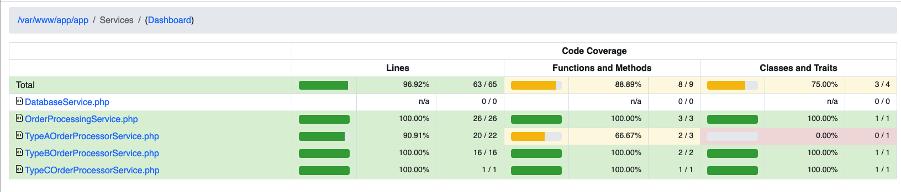

# Report coverage

# Test Cases for OrderProcessingService

## Constructor
- [ ] Ensure the constructor initializes `dbService` and `apiClient` correctly.

## processOrders Method
- [ ] Verify that `processOrders` retrieves orders for the given user ID.
- [ ] Ensure `processOrders` calls `processOrder` for each retrieved order.
- [ ] Test that `processOrders` returns the list of processed orders.
- [ ] Verify that `processOrders` returns `false` if an exception occurs.

## processOrder Method
- [ ] Test that `processOrder` processes orders of type `TYPE_A` using `TypeAOrderProcessor`.
- [ ] Test that `processOrder` processes orders of type `TYPE_B` using `TypeBOrderProcessor` with `apiClient`.
- [ ] Test that `processOrder` processes orders of type `TYPE_C` using `TypeCOrderProcessor`.
- [ ] Verify that `processOrder` sets the order status to `UNKNOWN_TYPE` for unsupported order types.
- [ ] Ensure `processOrder` assigns `HIGH` priority if the order amount exceeds `HIGH_PRIORITY_THRESHOLD`.
- [ ] Ensure `processOrder` assigns `LOW` priority if the order amount is below or equal to `HIGH_PRIORITY_THRESHOLD`.
- [ ] Verify that `processOrder` updates the order status and priority in the database.
- [ ] Test that `processOrder` sets the order status to `DB_ERROR` if a `DatabaseException` occurs during the update.

## Edge Cases
- [ ] Test with an empty list of orders to ensure no errors occur.
- [ ] Test with a mix of valid and invalid order types.
- [ ] Test with orders having edge-case amounts (e.g., exactly equal to `HIGH_PRIORITY_THRESHOLD`).
- [ ] Test with a database failure scenario to ensure proper error handling.
- [ ] Test with an API failure scenario for `TypeBOrderProcessor`.

## Performance
- [ ] Verify that `processOrders` handles a large number of orders efficiently.

---
# Test Cases for TypeAOrderProcessor

## process Method
- [ ] Verify that `process` correctly processes an order of type `TYPE_A`.
- [ ] Ensure `process` updates the order status to the appropriate value after processing.
- [ ] Test that `process` handles edge cases, such as missing or invalid order data.
- [ ] Verify that `process` does not modify unrelated order properties.
- [ ] Test with a valid `Order` object to ensure successful processing.
- [ ] Test with a null or invalid `Order` object to ensure proper error handling.

## Integration
- [ ] Verify that `TypeAOrderProcessor` integrates correctly with `OrderProcessingService`.
- [ ] Test that `TypeAOrderProcessor` handles dependencies or external calls (if any) correctly.

## Edge Cases
- [ ] Test with an order having minimal required data.
- [ ] Test with an order having maximum allowed data.
- [ ] Test with an order having unexpected or malformed data.

---

# Test Cases for TypeBOrderProcessor

## process Method
- [ ] Verify that `process` correctly processes an order of type `TYPE_B`.
- [ ] Ensure `process` uses the `APIClient` dependency correctly.
- [ ] Test that `process` updates the order status to the appropriate value after processing.
- [ ] Test that `process` handles API failures gracefully.
- [ ] Verify that `process` does not modify unrelated order properties.
- [ ] Test with a valid `Order` object to ensure successful processing.
- [ ] Test with a null or invalid `Order` object to ensure proper error handling.

## Integration
- [ ] Verify that `TypeBOrderProcessor` integrates correctly with `OrderProcessingService`.
- [ ] Test that `TypeBOrderProcessor` handles API interactions correctly.

## Edge Cases
- [ ] Test with an order having minimal required data.
- [ ] Test with an order having maximum allowed data.
- [ ] Test with an order having unexpected or malformed data.

---

# Test Cases for TypeCOrderProcessor

## process Method
- [ ] Verify that `process` correctly processes an order of type `TYPE_C`.
- [ ] Ensure `process` updates the order status to the appropriate value after processing.
- [ ] Test that `process` handles edge cases, such as missing or invalid order data.
- [ ] Verify that `process` does not modify unrelated order properties.
- [ ] Test with a valid `Order` object to ensure successful processing.
- [ ] Test with a null or invalid `Order` object to ensure proper error handling.

## Integration
- [ ] Verify that `TypeCOrderProcessor` integrates correctly with `OrderProcessingService`.

## Edge Cases
- [ ] Test with an order having minimal required data.
- [ ] Test with an order having maximum allowed data.
- [ ] Test with an order having unexpected or malformed data.